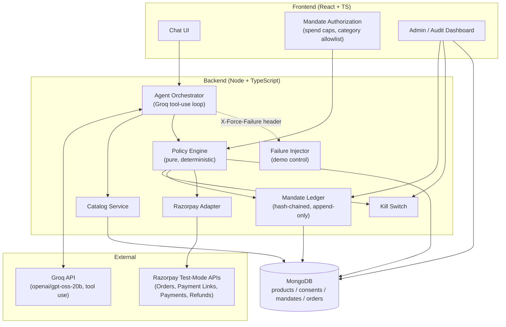
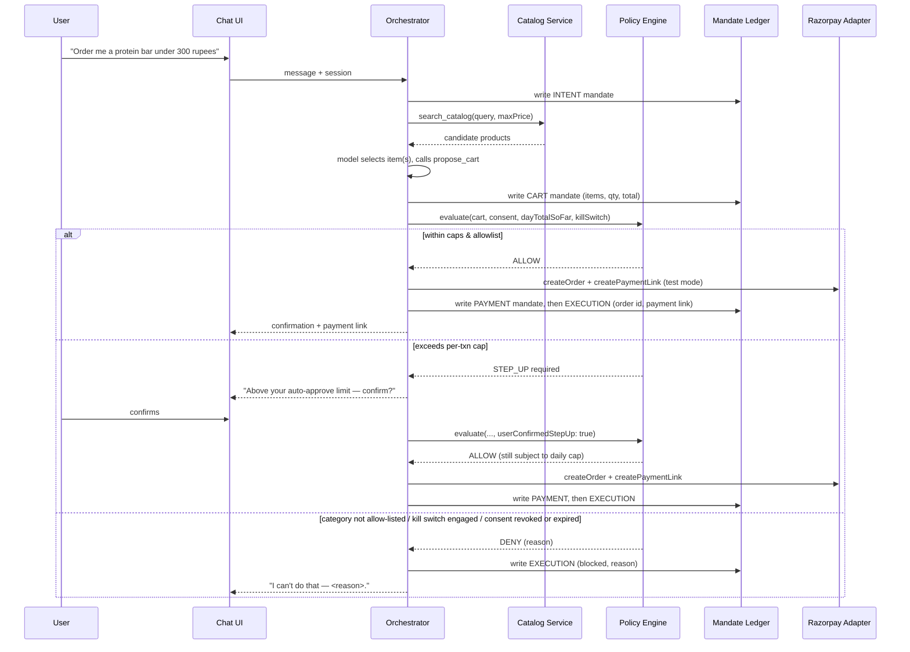

# Warden

A Track 01 (AI Growth & Agentic Commerce) build: a conversational shopping agent that can search a catalog, propose a cart, and execute a real Razorpay test-mode purchase — but never on its own authority. Every money-adjacent action is decided by a deterministic policy engine and recorded in a tamper-evident, hash-chained ledger before anything is executed.

Full spec and design rationale: [`docs/track1-agentic-storefront-architecture.md`](docs/track1-agentic-storefront-architecture.md) and [`docs/track1-context.md`](docs/track1-context.md). This README covers what's actually built, how to run it, and where it deliberately diverges from the spec.

## The one rule that matters

**The LLM never calls Razorpay directly.** The Agent Orchestrator (a Groq-hosted `openai/gpt-oss-20b` tool-use loop) can only *propose* — its tool set is `search_catalog`, `get_agent_meta`, `propose_cart`. There is no tool that charges money. Every proposed cart is evaluated by a pure, unit-tested Policy Engine (`backend/src/policy/policy.engine.ts`) — zero model calls, zero network calls — before the Razorpay Adapter is ever invoked. If someone asks "could this thing accidentally spend money it shouldn't?", the answer is: structurally, no — the model has no tool that spends money, and the code path from "model decides" to "money moves" always passes through a plain TypeScript function you can read top to bottom.

## Architecture



### Purchase flow, as actually implemented



**Divergence from the original spec, disclosed on purpose:** the architecture doc's sequence diagram describes "create order + capture" — direct card capture. This build uses `createOrder` + `createPaymentLink` instead: the user completes payment via a Razorpay-hosted link rather than an embedded checkout widget. This keeps the purchase flow fully server-verifiable without a client-side payment SDK. `capturePayment` and `refund` are implemented and unit-tested against a mocked Razorpay client, but aren't exercised by the live purchase flow in this build.

## Components

| Component | What it does | Where |
|---|---|---|
| **Catalog Service** | Agent-readable feed (`schema.org` JSON-LD) + agent-specific metadata (stock, refund window, max qty, upsell-of) | `backend/src/catalog/` |
| **Policy Engine** | Pure `evaluate()` — kill switch, revocation, expiry, category allowlist, daily cap, per-transaction cap / step-up. No LLM, no I/O. | `backend/src/policy/` |
| **Mandate Ledger** | Append-only, hash-chained (`sha256(prevHash + payload + createdAt)`) record of every INTENT → CART → PAYMENT → EXECUTION step. `verifyChain()` walks a chain and proves it hasn't been tampered with. | `backend/src/ledger/` |
| **Razorpay Adapter** | The only module allowed to talk to Razorpay. Thin typed wrapper (`createOrder`, `capturePayment`, `createPaymentLink`, `refund`) over the direct Node SDK, built against a narrow injectable client interface for testability. | `backend/src/razorpay/` |
| **Agent Orchestrator** | Groq (`openai/gpt-oss-20b`) tool-use loop (`search_catalog`, `get_agent_meta`, `propose_cart`) wired through the Policy Engine and Razorpay Adapter, via the OpenAI SDK pointed at Groq's OpenAI-compatible endpoint. | `backend/src/orchestrator/` |
| **Failure Injector** | `X-Force-Failure: decline \| out_of_stock \| cap_breach` header (also a dropdown in the Chat UI) — stages one of three failures and their recovery, both written to the ledger as distinct break/resolution records. | `backend/src/orchestrator/failure-injector.ts` |
| **Consent** | One-time spend authorization (per-txn cap, per-day cap, category allowlist, expiry) — the stand-in for UPI Reserve Pay / NPCI's UAP. | `backend/src/consent/` |
| **Admin / Audit Dashboard** | Live mandate-ledger table with per-row status chips and one-click chain-integrity verification, a policy-decisions feed, a kill-switch toggle, and consent revoke. | `frontend/src/components/AdminDashboard.tsx` |

## Running it

Prerequisites: Node 18+, a MongoDB connection string (Atlas free tier works fine), a Razorpay test-mode key pair, a Groq API key (free at https://console.groq.com/keys, no credit card required).

```bash
# 1. Fill in real values in .env.local (see .env.example for the variable names)
#    — MONGODB_URI, RAZORPAY_KEY_ID, RAZORPAY_KEY_SECRET, GROQ_API_KEY

# 2. Backend
cd backend
npm install
npm run seed              # seeds 18 catalog products
npm run dev                # http://localhost:4000

# 3. Frontend (separate terminal)
cd frontend
npm install
npm run dev                # http://localhost:5173
```

Useful backend scripts:

```bash
npm test                      # 62 unit tests — policy, ledger hash-chain, adapter, orchestrator, failure injector
npm run typecheck
npm run verify-chain -- <chainId>       # walk a real mandate chain and prove it's untampered
npm run razorpay:live-check             # sanity-check Razorpay test-mode keys (createOrder + createPaymentLink)
npm run seed-demo-activity              # seeds 5 realistic purchase sessions into the real DB — makes the Admin Dashboard demo-ready instead of empty
```

## Demo script

1. **Storefront tab** — show the Mandate Authorization panel: spend caps, category allowlist, expiry. Say the line: *"this is a deliberate, honest miniature of what Razorpay's live UPI Reserve Pay pilot does — consent captured once, up front, with explicit limits, not per-transaction OTP."*
2. **Chat**: ask for something in-policy and under the per-transaction cap (e.g. *"order me a protein bar under 300 rupees"*). Show the CART → policy-check → EXECUTION record cards, and the resulting Razorpay payment link.
3. **Chat**: ask for something over the per-transaction cap. Show the STEP_UP card, confirm it, and point out the daily cap is still enforced even on a confirmed step-up.
4. **Chat**: ask for something outside the category allowlist. Show the DENY card with its reason — *"the agent explained why it refused, it didn't pretend the request never happened."*
5. **Failure Injector**: pick "Force: out of stock" (or `decline` / `cap_breach`) from the dropdown and send a message. Show the resulting substitution/retry note in the chat.
6. **Admin Dashboard**: click a chain row, point at "Chain intact — N record(s) verified" — this is `verifyChain()` running live against the real hash chain, not a canned status. Then click into the failure-injector chain from step 5 and show the break record followed by the resolution record.
7. **Admin Dashboard**: engage the kill switch, go back to Chat, try to buy something — show it's denied with `kill switch engaged`, structurally, with no code path around it. Disengage it again.
8. **Admin Dashboard**: revoke consent (two-click confirm) and show a subsequent chat message is denied with `no consent on file`.

## Known limitations

- **Payment completion happens off-app.** The purchase flow produces a real Razorpay test-mode order and a real payment link; a human still has to open that link and pay with a test card to actually complete the transaction. `capturePayment`/`refund` are implemented and tested but not wired into the live flow.
- **The "agent is working" indicator in the Chat UI is presentational**, not a live feed of orchestrator state — the backend resolves a message in a single round trip and doesn't stream intermediate tool-call events.
- **Daily-cap tracking is scoped to `Order` records with `status: "created"`** — a cart that gets denied never reaches this collection, which is correct (nothing was spent), but it means the daily total only reflects successfully-allowed carts, not attempted ones.
- **Groq's open-weight model is somewhat less consistent than GPT-4o-mini at strictly following a tool-call JSON schema.** Occasionally it may skip a tool call or return a malformed one where GPT-4o-mini wouldn't — worth a quick sanity check before a live demo.

## Architecture decisions (deviations from `docs/`, made deliberately)

- **Groq instead of Claude** for the Agent Orchestrator's tool-use loop (originally built against OpenAI, then swapped to Groq's free tier — see CLAUDE.md for the swap details). The spec docs specify Claude (and lean on the real Razorpay/NPCI-on-Claude pilot as pitch narrative) — this project uses Groq's `openai/gpt-oss-20b` instead, via the OpenAI SDK pointed at Groq's OpenAI-compatible endpoint.
- **Direct Razorpay Node SDK instead of `razorpay-mcp-server`.** Chosen for control and debuggability during solo development. The app depends only on the `RazorpayAdapter` interface, so swapping the client implementation later doesn't touch the rest of the codebase.
- **Payment Links instead of embedded Checkout.js capture** — see "Divergence from the original spec" above.

## Tests

62 unit tests across the Policy Engine, hash-chain logic, Razorpay Adapter mapping/error-handling, orchestrator branching (including all three Failure Injector modes with mocked dependencies), and the kill switch. Every DB/network-touching path (catalog endpoints, ledger writes, live Razorpay calls, the full failure-recovery flow) has also been verified against the real MongoDB and real Razorpay test-mode API during development — not just mocked.

```bash
cd backend && npm test
```
