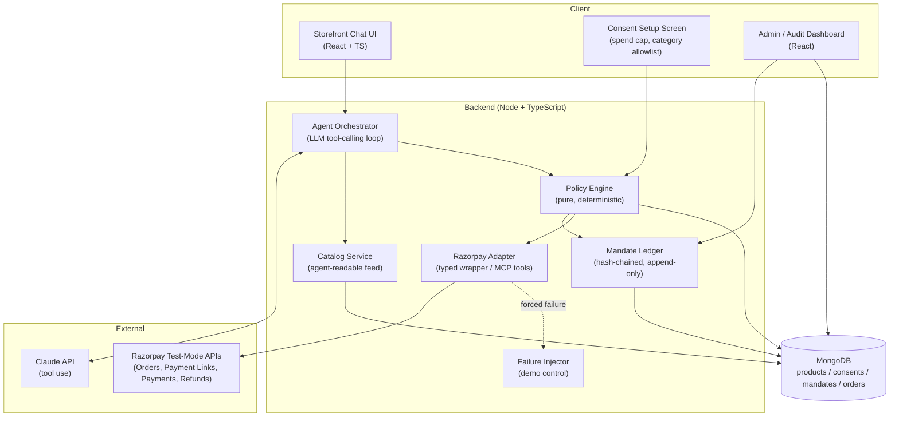
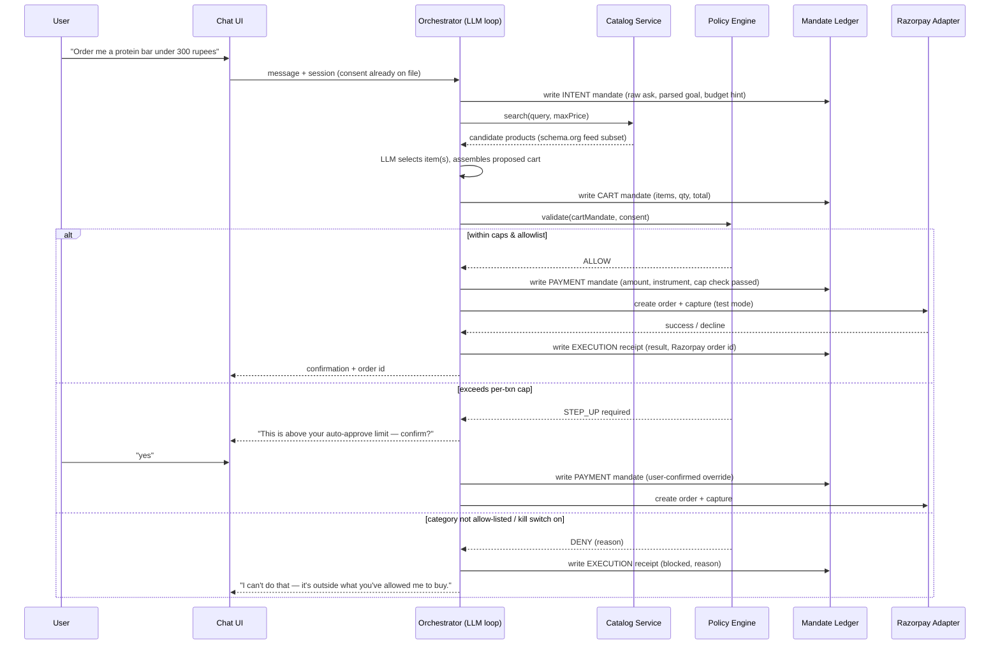

# Track 01 Build: Agentic Storefront — Full Architecture

**What this is:** a single, coherent system that covers three of Track 01's example directions at once — *conversational in-app checkout*, *agent-readable catalog*, and *upsell & cross-sell* — unified by one shared substrate: a deterministic policy engine and a cryptographically chained mandate ledger. That substrate is also your direct answer to "the bar": every money action explainable, bounded, gated, with one failure handled gracefully.

Stack choice is your existing one on purpose: React/TypeScript frontend, Node/TypeScript backend, MongoDB, Razorpay test-mode APIs, Claude for the agent loop. Nothing here requires learning a new language mid-buildathon.

---

## 1. System architecture



**The one rule that matters more than any box in this diagram:** the LLM never calls Razorpay directly. It proposes an action; the Policy Engine — plain TypeScript, no model in the loop — decides whether the Razorpay Adapter is allowed to execute it. That separation is what you defend in the architecture walkthrough when someone asks "what stops the agent from doing something insane."

---

## 2. The purchase flow, end to end



The DENY and STEP_UP branches are not edge cases you bolt on later — build them in week one. They're what you'll actually demo, because "the agent bought a snack" is boring and "the agent explained why it refused to buy something" is the moment judges lean forward.

---

## 3. Components in detail

### 3.1 Consent / spend-cap setup (your stand-in for UPI Reserve Pay / UAP)

A one-time screen the "user" fills before the agent runs: per-transaction cap, per-day cap, allowed categories, expiry, and a merchant identifier. This is a deliberate, honest miniature of what NPCI's UAP and Razorpay's live UPI Reserve Pay pilot actually do — consent captured once, up front, with explicit limits, not per-transaction OTP. Saying that out loud in your pitch (with the real pilot as the reference point) is worth more than the UI itself.

```ts
interface Consent {
  userId: string;
  merchantId: string;
  spendCapPerTxn: number;      // paise
  spendCapPerDay: number;      // paise
  categoryAllowlist: string[]; // e.g. ["food", "groceries"]
  expiresAt: Date;
  revoked: boolean;
}
```

Expose a `POST /consent/revoke` endpoint and wire a visible "revoke" button into the Admin Dashboard — "the ability to revoke consent instantly" is a phrase straight out of Razorpay's own pilot messaging, and demonstrating it live costs you one button.

### 3.2 Catalog Service — the agent-readable feed

Two endpoints, not one:

- `GET /catalog/feed.json` — standard `schema.org/Product` + `Offer` JSON-LD, so any ACP/AP2-style agent (not just yours) could in principle read it.
- `GET /catalog/agent-meta/:sku` — the fields a generic e-commerce API never bothers to expose, but an autonomous buyer needs: live stock count, machine-readable refund window (`refundWindowDays`, not a link to a PDF), max quantity per order, category (must match your `categoryAllowlist` vocabulary exactly), and an `upsellOf: [sku]` field the orchestrator can query for cross-sell suggestions.

```ts
interface AgentMeta {
  sku: string;
  stock: number;
  refundWindowDays: number;
  categoryTags: string[];
  maxQtyPerOrder: number;
  upsellOf: string[];
}
```

This is the concrete artifact that answers "agent-readable catalog" — a human demo of "look, I can curl this and a completely different agent could shop here" is a strong, cheap proof point.

### 3.3 Policy Engine — deterministic, unit-tested, zero LLM involvement

This is a pure function, testable without ever calling the model:

```ts
type PolicyResult =
  | { decision: "ALLOW" }
  | { decision: "STEP_UP"; reason: string }
  | { decision: "DENY"; reason: string };

function evaluate(cart: CartMandate, consent: Consent, dayTotalSoFar: number): PolicyResult {
  if (consent.revoked || killSwitch.isEngaged(consent.merchantId)) {
    return { decision: "DENY", reason: "kill switch engaged" };
  }
  if (!cart.items.every(i => consent.categoryAllowlist.includes(i.category))) {
    return { decision: "DENY", reason: "category not allow-listed" };
  }
  if (dayTotalSoFar + cart.total > consent.spendCapPerDay) {
    return { decision: "DENY", reason: "daily cap exceeded" };
  }
  if (cart.total > consent.spendCapPerTxn) {
    return { decision: "STEP_UP", reason: "exceeds per-transaction auto-approve limit" };
  }
  return { decision: "ALLOW" };
}
```

Write this before you write a single line of prompt engineering. Give it a real unit test file with 6–8 cases (allow, deny by category, deny by kill switch, deny by daily cap, step-up, step-up then confirmed). That test file is one of the strongest single artifacts you can point to in the "code quality" part of the rubric — it proves the guardrail isn't vibes.

### 3.4 Mandate Ledger — the audit trail, made tamper-evident

Append-only Mongo collection. Every record hashes in the previous record's hash, so altering history breaks the chain — this is the same non-repudiation idea AP2 builds with signed Verifiable Digential Credentials, done with primitives you already have.

```ts
interface MandateRecord {
  _id: string;
  chainId: string;         // one per user session / purchase flow
  seq: number;
  type: "INTENT" | "CART" | "PAYMENT" | "EXECUTION";
  payload: Record<string, unknown>;
  prevHash: string;
  hash: string;             // sha256(prevHash + JSON.stringify(payload) + createdAt)
  createdAt: Date;
}
```

Build a small standalone `verifyChain(chainId)` script that walks a chain and confirms every hash matches. Running that script live during the architecture walkthrough — "here's proof this log wasn't edited after the fact" — is a two-minute demo that most other teams simply won't have, because most teams will log to `console.log` and call it an audit trail.

### 3.5 Razorpay Adapter

A thin, fully typed wrapper — this is the *only* module allowed to talk to Razorpay, and it's called only after `Policy Engine` returns `ALLOW`.

```ts
interface RazorpayAdapter {
  createOrder(amountPaise: number, currency: "INR", receipt: string): Promise<RPOrder>;
  capturePayment(paymentId: string, amountPaise: number): Promise<RPPayment>;
  createPaymentLink(amountPaise: number, description: string): Promise<RPPaymentLink>;
  refund(paymentId: string, amountPaise: number): Promise<RPRefund>;
}
```

Two implementation paths, pick one and mention you considered the other (this is a free "architecture decision" talking point):
- **Direct Node SDK** (`razorpay` npm package) against test-mode keys — most control, fastest to debug.
- **Razorpay's own MCP server** (`razorpay/razorpay-mcp-server`) as the tool-calling backend for the orchestrator — scores points for using Razorpay's own agent tooling exactly as intended, at the cost of an extra process to run and less control over error shapes.

### 3.6 Agent Orchestrator

The actual LLM loop (Claude tool-use). Tools exposed to the model are deliberately narrow and *read-heavy*: `search_catalog`, `get_agent_meta`, `propose_cart` — note there is no `charge_card` tool. The model can only ever *propose*; every proposal round-trips through the Policy Engine in your own backend code before anything resembling money moves. This is the single most important sentence in your README, because it's the answer to the question every judge will ask a Track 01 team: *"could this thing accidentally spend money it shouldn't?"* — and your answer is "structurally, no, because the model has no tool that spends money."

### 3.7 Failure Injector — your staged failure, on purpose

A demo-only toggle (`X-Force-Failure: decline | out_of_stock | cap_breach` header, or an admin-dashboard switch) that forces one of:

- Razorpay test-mode decline (Razorpay publishes test cards that always fail — use one deliberately).
- An item going out of stock between cart assembly and checkout.
- A cart that blows past the per-transaction cap.

And the orchestrator's recovery for each: offer a substitute item (out-of-stock), retry via payment link instead of direct capture (decline), or trigger the STEP_UP flow and wait for explicit confirmation (cap breach). Whichever you pick, the Mandate Ledger must show the break and the resolution as two distinct, timestamped records — that pairing is literally what "one failure handled gracefully" is asking to see.

### 3.8 Admin / Audit Dashboard

A single React page, not a project in itself: a live table of the mandate ledger (filterable by chain), a feed of Policy Engine decisions with reasons, and the consent-revoke button. This is what's on screen for the entire second half of your demo.

---

## 4. Data model (MongoDB collections)

| Collection | Key fields | Notes |
|---|---|---|
| `products` | sku, name, price, category, stock, refundWindowDays, upsellOf[] | seed 15–20 realistic SKUs, not 3 |
| `consents` | userId, merchantId, spendCapPerTxn, spendCapPerDay, categoryAllowlist[], expiresAt, revoked | one active consent per user/merchant pair |
| `mandates` | chainId, seq, type, payload, prevHash, hash, createdAt | append-only, indexed on chainId+seq |
| `orders` | razorpayOrderId, chainId, status, amount | local mirror for the dashboard |

---

## 5. Build plan (solo, buildathon-scoped)

1. **Scaffold + catalog** — repo structure, Mongo schemas, seed products, `/catalog/feed.json` and `/catalog/agent-meta/:sku` live.
2. **Policy Engine + Mandate Ledger, fully tested, no LLM yet.** Build and unit-test these two modules before touching a prompt — they're the deterministic core the whole pitch leans on.
3. **Razorpay Adapter against test mode** — order creation, capture, refund, payment link, all gated behind a manual `ALLOW`-only stub of the policy check so you can verify Razorpay integration independent of the agent.
4. **Agent Orchestrator + Chat UI** — wire Claude tool-use to `search_catalog` / `propose_cart`, connect the real Policy Engine, connect the real Razorpay Adapter.
5. **Failure Injector + recovery flow** — the staged failure, end to end, ledger-visible.
6. **Admin/Audit Dashboard** — live ledger view, policy-decision feed, consent revoke.
7. **README + demo script + buffer.** Write the README's architecture section before the buffer day, not after — it's part of the rubric, not paperwork.

---

## 6. What to say in the architecture walkthrough

Map every answer back to a rubric line, not to "cool tech":

- *"Why is the policy engine separate from the LLM?"* → because the LLM's job is proposing, never authorizing; determinism and testability live outside the model.
- *"How do you know the audit trail is real?"* → run `verifyChain()` live.
- *"What happens when something fails?"* → trigger the Failure Injector, walk the ledger's two records (break, resolution).
- *"Why this catalog format?"* → it's schema.org-compatible, so it's not just readable by your agent — it's the same shape ACP and AP2-speaking agents already expect.

---

## 7. Stretch goals, if time remains

- Swap the hand-rolled Razorpay Adapter for the official `razorpay-mcp-server` and show both working (extra credibility with Razorpay's own team).
- A second sub-agent for cross-sell that proposes an `upsellOf` item, but — important — it still goes through the same Policy Engine as everything else, no shortcut.
- A minimal AP2-shaped export of a mandate chain (their actual JSON mandate schema) as a "we're compatible with where the industry is headed" flourish, without needing their SDK.